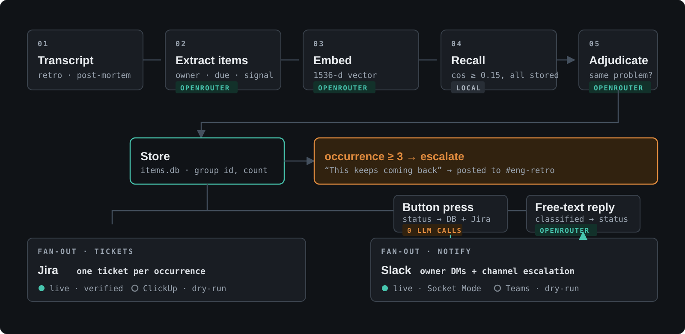

# Groundhog Loop

Action items from retros and post-mortems get spoken, written down, and quietly
dropped. Worse, the same problem resurfaces months later as a "new" action item
and nobody notices it's the third time — so it gets re-triaged from scratch
instead of escalated as a systemic issue.

This backend closes that loop:

```
transcript ─▶ extract ─▶ embed ─▶ recurrence check ─▶ store
                                         │
                                         ├─▶ tickets    → Jira + ClickUp
                                         └─▶ notify     → Slack + Teams
                                                  │
                          button press ───────────┤ (direct write, no LLM)
                          free text    ───────────┘ (classified by the LLM)
```



The diagram reflects the demo configuration: Jira and Slack run live when
configured; ClickUp and Teams remain dry-run. Slack button choices write the
status directly to SQLite and Jira—no model call—while free-text replies are
classified by the configured model.

A scheduler nudges owners as due dates approach, escalates what goes stale to
the team channel, and — the point of the whole thing — shouts when an item is
provably a repeat offender.

## Quick start

```bash
python3 -m venv --system-site-packages .venv
.venv/bin/pip install -r requirements.txt
cp env.example .env           # add OPENROUTER_API_KEY; everything else is optional

.venv/bin/python demo.py --sample all --reset-db
```

That runs all three sample transcripts through the full pipeline and narrates
every step. With no Jira/ClickUp/Slack/Teams credentials set, those adapters
**dry-run**: each prints the exact HTTP request it would have sent and returns a
synthetic ticket ID. Nothing is stubbed — only the socket write is gated, so the
response-parsing code runs either way.

No OpenRouter key either? `--fake-llm` stubs the model too and the pipeline still
runs end to end. It proves the plumbing, not the semantics.

```bash
.venv/bin/python demo.py --sample all --reset-db --fake-llm   # fully offline
.venv/bin/python demo.py --list                               # what's in the DB
.venv/bin/python demo.py --run-scheduler                      # nudges + escalations
.venv/bin/python demo.py --button 3 done                      # button path (no LLM)
.venv/bin/python demo.py --reply 3 "blocked on the vendor"    # free-text path (LLM)
.venv/bin/python demo.py --payloads ...                       # full request bodies
cat notes.txt | .venv/bin/python demo.py --stdin
```

## Swapping providers

Every model call goes through OpenRouter's OpenAI-compatible API. Changing model
is one line in `.env` and touches no code:

```bash
LLM_MODEL=anthropic/claude-sonnet-4.5     # or openai/gpt-4o-mini, or ...
EMBEDDING_MODEL=openai/text-embedding-3-small
```

Embedding models are catalogued **separately** from chat models — they do not
appear in `GET /models`. List them with:

```bash
curl https://openrouter.ai/api/v1/embeddings/models | python3 -m json.tool
```

> Changing `EMBEDDING_MODEL` invalidates every stored vector: embeddings from
> different models are not comparable. `check_recurrence` detects the dimension
> change, skips those rows and logs a warning rather than returning nonsense.
> To re-baseline, start a fresh DB (`--reset-db`).

## Enabling a real platform

Adapters are independent. Fill in one platform's credentials and it goes live
while the rest keep dry-running:

```bash
ENABLED_TICKET_ADAPTERS=jira,clickup
ENABLED_NOTIFIER_ADAPTERS=slack,teams
```

Set `DRY_RUN=true` to force everything offline, `DRY_RUN=false` to require
everything live, or leave it unset for per-adapter automatic behaviour.

**Slack buttons** need the listener running — it uses Socket Mode, so no public
URL, ngrok or deploy:

```bash
.venv/bin/python slack_listener.py
```

Setup steps are at the top of `slack_listener.py`. It handles the three
quick-reply buttons, free-text replies, and `/groundhogloop`.

**Teams** uses a Power Automate Workflows webhook. The classic Office 365
connector webhooks were retired by Microsoft on 18–22 May 2026 and no longer
deliver, so create a Workflows one: channel `...` → Workflows → *"Post to a
channel when a webhook request is received"*.

Because that webhook is one-way, Teams gets a free-text prompt rather than
buttons (`supports_buttons = False`). The `NotifierAdapter` interface is
unchanged, so a Bot Framework backend could replace the transport later without
touching any caller.

## Tuning without a restart

```
/groundhogloop show
/groundhogloop set nudge_days_before 3
/groundhogloop set recurrence_threshold 0.82
/groundhogloop run
```

These write `agent_config.json`, which `config.reload()` layers over `.env` at
the start of every scheduler cycle.

## Layout

| File | Role |
|---|---|
| `config.py` | Every key, model name and threshold. Nothing else reads `os.environ`. |
| `llm_client.py` | The only place a provider is called. Chat + embeddings, fence-tolerant JSON parsing. |
| `extraction.py` | `extract_action_items`, `classify_reply` |
| `recurrence.py` | `cosine_similarity`, `check_recurrence` |
| `storage.py` | SQLite `items` table |
| `pipeline.py` | Orchestration, shared by demo / scheduler / listener |
| `scheduler.py` | `run_n_cycle`, the `/groundhogloop` command |
| `slack_listener.py` | Socket Mode receiver (buttons, replies, slash command) |
| `demo.py` | Traceable CLI |
| `adapters/ticket_*` | `TicketAdapter` ABC, Jira, ClickUp, fan-out manager |
| `adapters/notifier_*` | `NotifierAdapter` ABC, Slack, Teams, fan-out manager |

Adding a platform is one file plus one line in that manager's `REGISTRY`.
Nothing in `pipeline.py`, `demo.py` or `scheduler.py` names a platform.

## Design notes

- **Structured replies never reach the LLM.** `pipeline.apply_structured_reply`
  imports nothing from `extraction`; button presses are a direct DB write.
- **Extraction asks for `{"action_items": [...]}`, not a bare array.** Provider
  JSON mode rejects a top-level array on several backends — a failure that only
  shows up after someone swaps `LLM_MODEL`.
- **One adapter failing never suppresses the others.** Both managers collect
  per-adapter errors and carry on, so a ClickUp outage still gets the Jira ticket
  filed.
- **`last_nudged_at` / `last_escalated_at`** keep the scheduler idempotent within
  `RENUDGE_AFTER_HOURS`. Without them, every run re-DMs every open item.
- **Recurrence files a new ticket per occurrence**, tagged with the shared
  `recurrence_group_id` and naming the prior tickets; earlier tickets get a
  back-link comment. At `RECURRENCE_ESCALATE_COUNT` occurrences it posts a
  "this keeps coming back" escalation to the team channel on every notifier.
- **Jira v3 needs ADF**, not plain strings, for descriptions and comments; and it
  has no writable status field, so `update_status` reads the available
  transitions and posts a matching transition id.
- **ClickUp's auth header takes the bare token** — `Authorization: pk_...`.
  A `Bearer` prefix returns 401.
